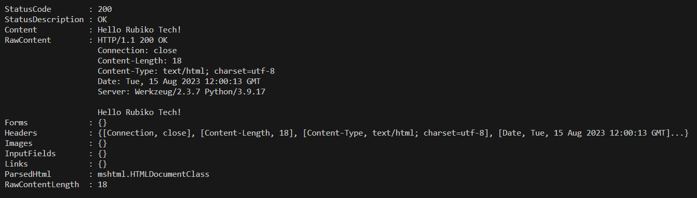

# rubiko-basic-docker

Este repositorio contiene un ejemplo de una aplicación Flask empaquetada en un contenedor Docker. 
La aplicación responde a peticiones GET en el endpoint `/health` con un mensaje "OK".

## Cómo lanzar un contenedor rubiko-basic-docker con Docker

1. Clona este repositorio: `git clone <https://github.com/Feitizeira/rubiko-docker>`
2. Navega al directorio del repositorio: `cd rubiko-docker`
3. Construye la imagen Docker: `docker build -t rubiko-basic-docker .`
4. Ejecuta el contenedor: `docker run -p 5050:5000 rubiko-basic-docker`

Ahora puedes acceder a la aplicación Flask en tu navegador en `http://localhost:5050/health`.

## Cómo lanzar el Docker Compose

1. Clona este repositorio: `git clone <https://github.com/Feitizeira/rubiko-docker>`
2. Navega al directorio del repositorio: `cd rubiko-docker`
3. Ejecuta el Docker Compose: `docker-compose up`

El servicio "curl" realizará una llamada a la aplicación y mostrará el resultado:
curl http://localhost:5050/health

